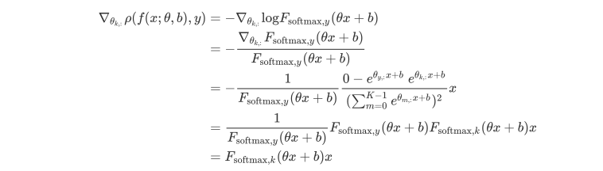

# Logistic Regression on MNIST with NumPy from Scratch
Implementing Logistic Regression on MNIST dataset from scratch

## Project Description

Implement and train a logistic regression model from scratch in Python on the MNIST dataset (no PyTorch). The logistic regression model should be trained on the Training Set using stochastic gradient descent. It should achieve 90-93% accuracy on the Test Set.

## Highlights

- **Logistic Regression**
- **SGD with momentum**
- **Learning Rate Decaying**

## Theoretical Derivation

We put the pictures of the mathematical equations and symbols in the algorithm here due to GitHub's incompatibility with math expressions. The raw LaTeX expression is included in `./math_raw.md`.

### Model

Consider a logistic regression model for classification where , weights  and biases . Given an input , the model  produces a probability of each possible outcome in :


where  is the -th element of the vector $z$. The set of probabilities on  is  The function  is called the “softmax function” and is frequently used in deep learning.  takes a K-dimensional input and produces a probability distribution on $\mathcal{Y}$. That is, the output of is a vector of probabilities for the events . The softmax function can be thought of as a smooth approximation to the argmax function since it pushes its smallest inputs towards 0 and its largest input towards 1. 

### Objective Function

The objective function is the negative log-likelihood (commonly referred to in machine learning as the “cross-entropy error”): 


### Mini-batch Gradient descent


### Derivation of SGD

We will derive the stochastic gradient descent algorithm for the logistic regression model. The logistic regression model  is estimated from the dataset  where .

The gradient of the loss function for a generic data sample  is


where  is the k-th element of the vector output of the function . Let  be the k-th row of the matrix . 

If , 



If ,


Hence, for any k,		


Therefore,


where,


Similarly, we could get the gradient of the loss function with respect to :


The stochastic gradient descent algorithm is:

- Randomly initialize the parameter .

- For  :

  - Select  data samples  at random from the dataset , where .
  - Calculate the gradient for the loss from the data sample:

  
  
  

  - Update the parameters:

  
  
  
  
where  is the learning rate.

## Implementation

The model and main function is included in the script file `logistic_regression.py`. The outputs text are stored in `./logs/` as `.log` files, and the plots for the loss trend and accuracy trend are stored in `./assets/`. All the hyperparameters are stored in `./configs/` as `.json` files. Example: `config_sample.json`

```json
{
    "num_epoches" : 15,
    "batch_size" : 10,
    "learning_rate" : 0.0025,
    "learning_decay" : 0,
    "decay_factor" : 0.75,
    "momentum" : 0,
    "mu" : 0.9
}
```

Note that we implemented available options of **learning decay** and **SGD with momentum**.

In the code, I first loaded the MNIST data, and then set the random seed. After initializing the parameters, I trained the model using mini-batch stochastic gradient descent. If needed, **learning decay** (decay the learning rate by the decay factor when the test accuracy declines or increases by less than 0.1%) and **SGD with momentum**.

**SGD with Momentum:**

```python
if bool(hyp['momentum']) == True:
    w_velocity = mu * w_velocity + learning_rate * dw
    b_velocity = mu * b_velocity + learning_rate * db
    param['w'] -= w_velocity
    param['b'] -= b_velocity
```

**Learning Decay:**

```python
if bool(hyp['learning_decay']) == True:
    try:
        if test_accu_list[-1] - test_accu_list[-2] < 0.001:
            learning_rate *= hyp['decay_factor']
    except:
        pass
```

For each epoch, we evaluate the loss and accuracy.

## Training Results

The training results of 4 configurations are shown as follows. 


|                       |             config_sample              |             config_1              | config_2                          | config_3                          |
| :-------------------: | :------------------------------------: | :-------------------------------: | :---------------------------------: | :---------------------------------: |
|       Optimizer       |                  SGD                   |                SGD                | SGD                               | SGD                               |
|   Number of Epoches   |                   15                   |                15                 | 15                                | 15                                |
|      Batch Size       |                   10                   |              **100**              | **100**                           | 10                                |
|     Learning Rate     |                 0.005                  |            **0.0025**             | **0.0025**                        | 0.005                             |
|    Learning Decay     |                  ----                  |               ----                | ----                              | **0.75**                          |
| Momentum () |                  ----                  |               ----                | **0.9**                           | ----                              |
|   Optimal Test Loss   |           3310.17 @ Epoch 6            |        4618.44 @ Epoch 15         | 3296.48 @ Epoch 15                | 3310.17 @ Epoch 6                 |
| Optimal Test Accuracy |            0.9093 @ Epoch 6            |         0.8861 @ Epoch 15         | 0.9091 @ Epoch 15                 | 0.9093 @ Epoch 6                  |
|      Loss Trend       |  |  |  |  |
|    Accuracy Trend     |  |  |  |  |

Comments: 

- **Config_sample:** The accuracy drops after epoch 6 . 
- **Config_1:** By increasing the batch size and decreasing the learning rate, the convergence rate decreases because of fewer descent iterations.
- **Config_2:** Adding momentum allows the model to converge faster.
- **Config_3:** Allowing learning decay prevents the accuracy from dropping dramatically.