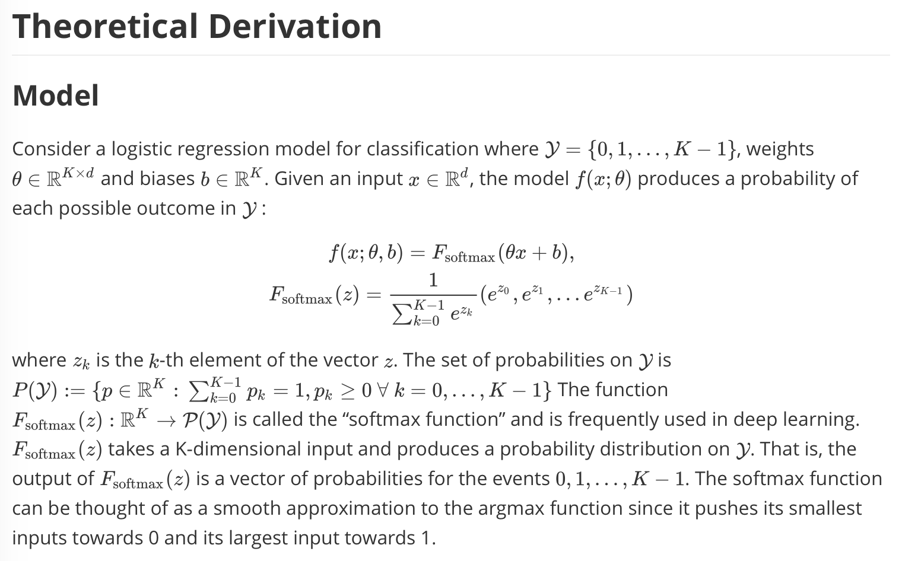
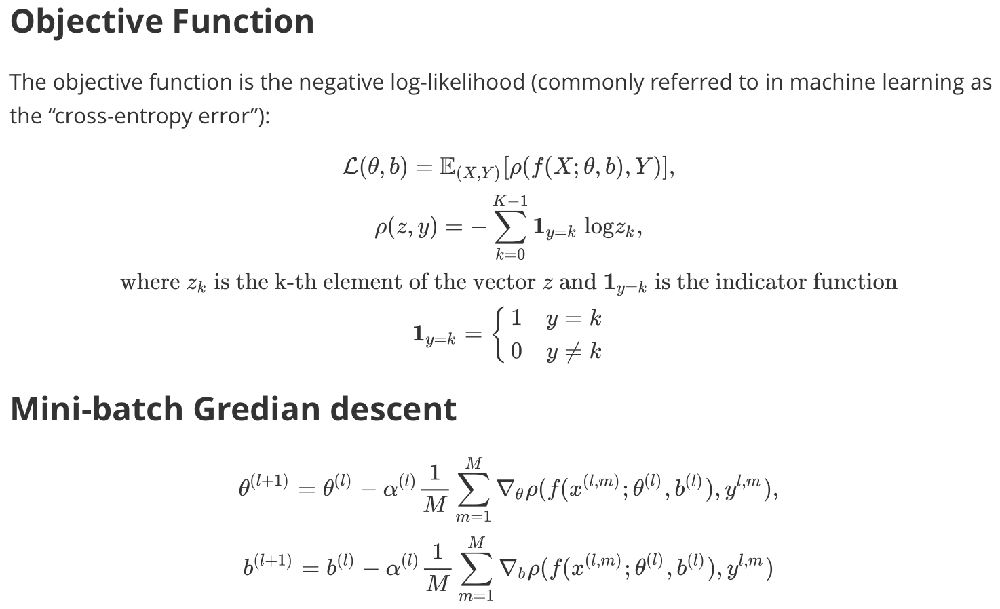
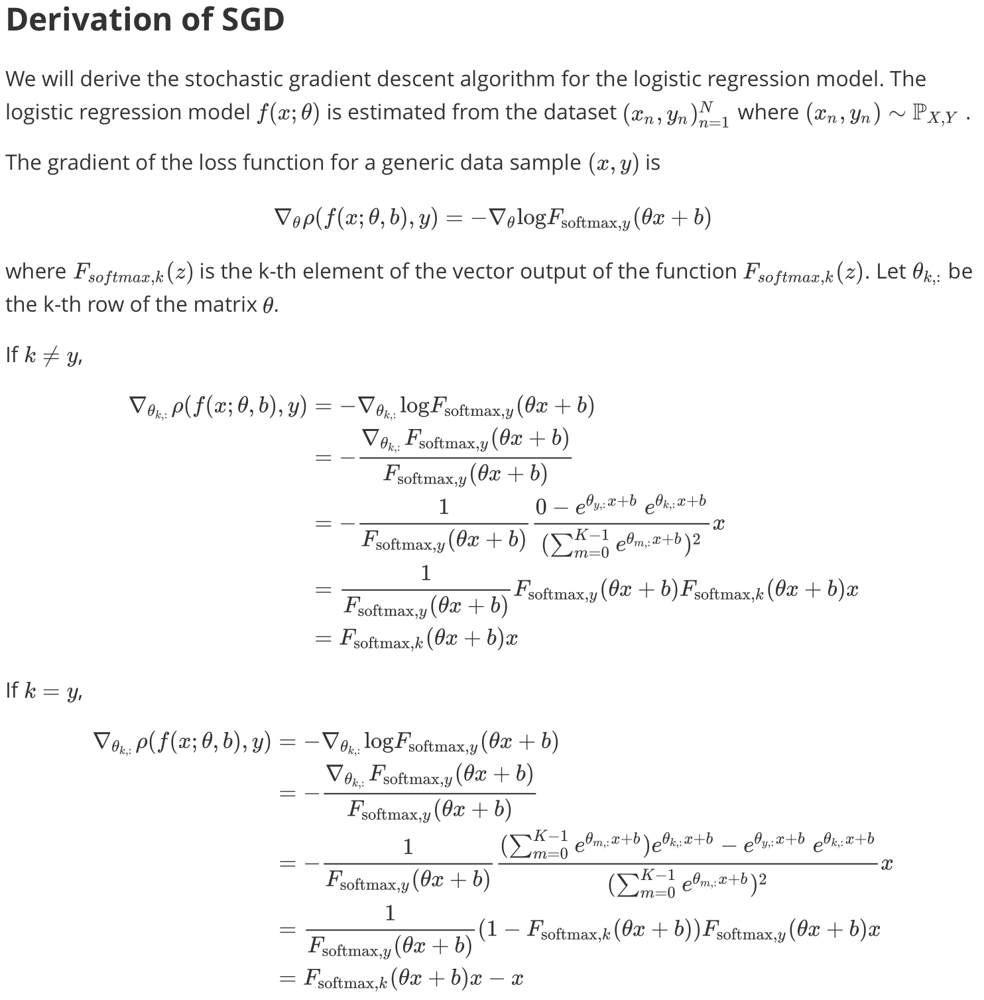
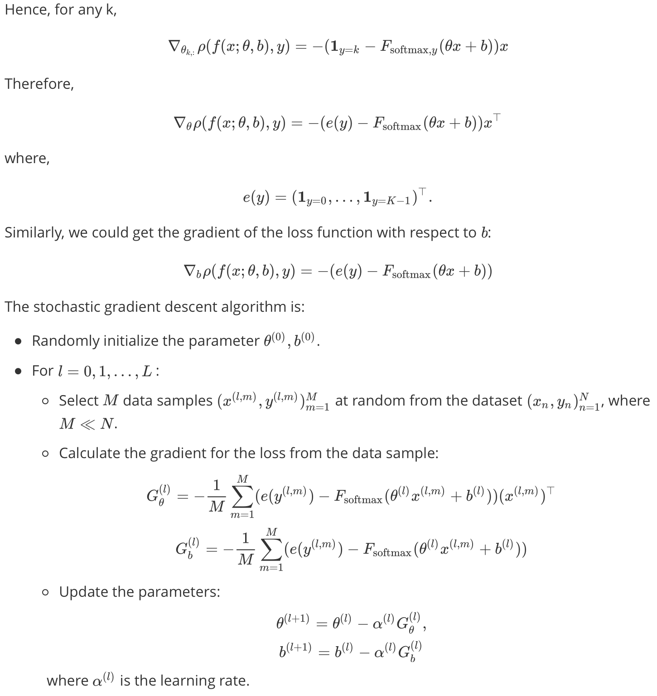
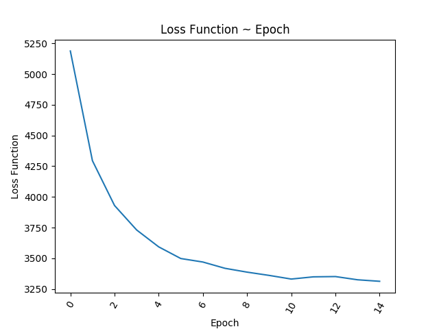
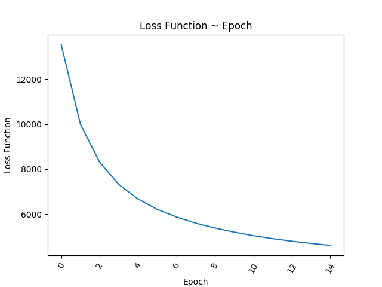
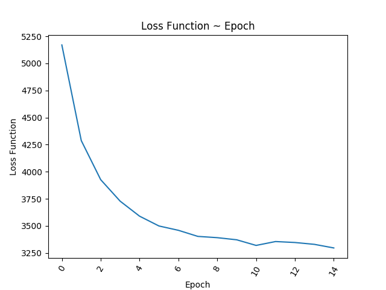
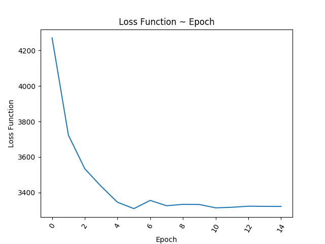
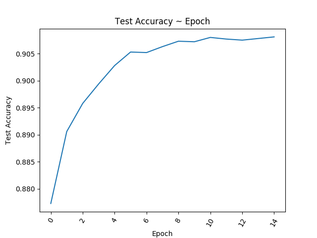
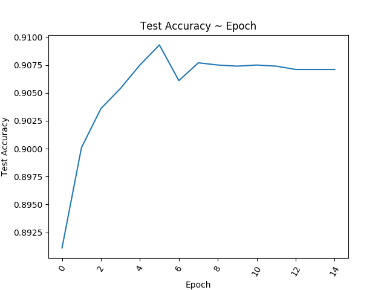

# Logistic Regression on MNIST with NumPy from Scratch
Implementing Logistic Regression on MNIST dataset from scratch

## Project Description

Implement and train a logistic regression model from scratch in Python on the MNIST dataset (no PyTorch). The logistic regression model should be trained on the Training Set using stochastic gradient descent. It should achieve 90-93% accuracy on the Test Set.

## Highlights

- **Logistic Regression**
- **SGD/SGD with momentum**
- **Learning Rate Decaying**

## Theoretical Derivation

We put the screenshots of the mathematical derivation of the algorithm here due to GitHub's incompatibility with math expressions. The raw LaTeX expression is included in `./math_raw.md`.









## Implementation

The model and main function is included in the script file `logistic_regression.py`. The outputs text are stored in `./logs/` as `.log` files, and the plots for the loss trend and accuracy trend are stored in `./assets/`. All the hyperparameters are stored in `./configs/` as `.json` files. Example: `config_sample.json`

```json
{
    "num_epoches" : 15,
    "batch_size" : 10,
    "learning_rate" : 0.0025,
    "learning_decay" : 0,
    "decay_factor" : 0.75,
    "momentum" : 0,
    "mu" : 0.9
}
```

Note that we implemented available options of **learning decay** and **SGD with momentum**.

In the code, I first loaded the MNIST data, and then set the random seed. After initializing the parameters, I trained the model using mini-batch stochastic gradient descent. If needed, **learning decay** (decay the learning rate by the decay factor when the test accuracy declines or increases by less than 0.1%) and **SGD with momentum**.

**SGD with Momentum:**

```python
if bool(hyp['momentum']) == True:
    w_velocity = mu * w_velocity + learning_rate * dw
    b_velocity = mu * b_velocity + learning_rate * db
    param['w'] -= w_velocity
    param['b'] -= b_velocity
```

**Learning Decay:**

```python
if bool(hyp['learning_decay']) == True:
    try:
        if test_accu_list[-1] - test_accu_list[-2] < 0.001:
            learning_rate *= hyp['decay_factor']
    except:
        pass
```

For each epoch, we evaluate the loss and accuracy.

## Training Results

The training results of 4 configurations are shown as follows. 


|                       |             config_sample              |             config_1              | config_2                          | config_3                          |
| :-------------------: | :------------------------------------: | :-------------------------------: | --------------------------------- | --------------------------------- |
|       Optimizer       |                  SGD                   |                SGD                | SGD                               | SGD                               |
|   Number of Epoches   |                   15                   |                15                 | 15                                | 15                                |
|      Batch Size       |                   10                   |              **100**              | **100**                           | 10                                |
|     Learning Rate     |                 0.005                  |            **0.0025**             | **0.0025**                        | 0.005                             |
|    Learning Decay     |                  ----                  |               ----                | ----                              | **0.75**                          |
|   Momentum ($\mu$)    |                  ----                  |               ----                | **0.9**                           | ----                              |
|   Optimal Test Loss   |           3310.17 @ Epoch 6            |        4618.44 @ Epoch 15         | 3296.48 @ Epoch 15                | 3310.17 @ Epoch 6                 |
| Optimal Test Accuracy |            0.9093 @ Epoch 6            |         0.8861 @ Epoch 15         | 0.9091 @ Epoch 15                 | 0.9093 @ Epoch 6                  |
|      Loss Trend       |  |  |  |  |
|    Accuracy Trend     |  |  |  |  |

Comments: 

- **Config_sample:** The accuracy drops after epoch 6 . 
- **Config_1:** By increasing the batch size and decreasing the learning rate, the convergence rate decreases because of fewer descent iterations.
- **Config_2:** Adding momentum allows the model to converge faster.
<<<<<<< HEAD
- **Config_3:** Allowing learning decay prevents the accuracy from dropping dramatically.
=======
- **Config_3:** Allowing learning decay prevents the accuracy from dropping dramatically.
>>>>>>> cfa556453f8da4ef5bd538db12989d41d5f7f51a
